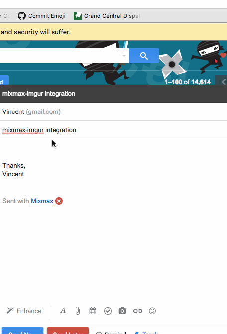

# Mixmax Link Preview Integration with Imgur

This is an open source Mixmax Link Resolver. See <http://sdk.mixmax.com/docs/tutorial-giphy-link-preview> for more information about how to use this example code in Mixmax.



## Running locally

1. Install using `bundle install`
2. Run using `rails s`

To simulate locally how Mixmax calls the resolver URL (to return HTML that goes into the email), run:

```
curl http://localhost:3000/resolver?url=imgur.com/yXHLZeb
```

##Mixmax Parameters

|Input name|Value|
|---  |---|
|Description|Imgur|
|Regex|imgur.com\/?(gallery)?\/[^\/]+$|
|Resolver URL|http://localhost:3000/resolver|
